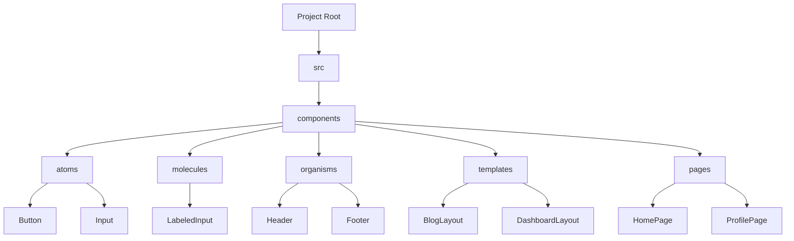

# Atom Design

Atom Designは、再利用可能で一貫性のあるデザイン構造を構築するための方法論です。このデザイン手法は、5つの主要なコンポーネントに分けられています。それぞれのコンポーネントは、システム全体の再利用性とスケーラビリティを高めるための役割を果たします。



## 1. Atoms(原子)

Atomsは、UIの最小単位です。ボタン、ラベル、入力フィールドなどの基本的な要素が含まれます。これらは、それ単体では機能的なコンポーネントではなく、他のコンポーネントと組み合わせて使われます。

### 例

- ボタン
- テキストボックス
- アイコン

```html
<button>Click me</button>
<input type="text" placeholder="Enter text">
```

## 2. Molecules(分子)

Moleculesは、Atomsを組み合わせて作られる、簡単なUIコンポーネントです。例えば、ラベル付きの入力フィールドはMoleculeとなります。Moleculesは、特定の機能を持つ小さいUIユニットとして機能します。

### 例

- ラベル付きの入力フィールド
- アイコン付きのボタン

```html
<label for="email">Email</label>
<input type="email" id="email">
```

## 3. Organisms(生物)

Organismsは、複数のMoleculesやAtomsを組み合わせて形成される、より複雑なUIコンポーネントです。Organismsは具体的で自律的なUIの一部分を提供します。

### 例

- ヘッダー
- フッター
- ナビゲーションバー

```html
<header>
    <nav>
        <ul>
            <li><a href="#">Home</a></li>
            <li><a href="#">About</a></li>
            <li><a href="#">Contact</a></li>
        </ul>
    </nav>
</header>
```

## 4. Templates

Templatesは、Atoms, Molecules,
Organismsを使用して作成されたページのレイアウトです。Templatesは構造を提供しますが、具体的な内容は持ちません。これにより、複数のページで再利用できる形式が提供されます。

### 例

- ブログのレイアウト
- ダッシュボードのレイアウト

```html
<div class="template">
    <header>...</header>
    <main>...</main>
    <footer>...</footer>
</div>
```

## 5. Pages

PagesはTemplatesにコンテンツを埋め込んだ最終的な画面です。Pagesは、システム全体で一貫性を保ちながら、具体的な内容とデータをユーザーに提供します。

### 例

- ホームページ
- プロフィールページ

```html
<div class="page">
    <header>...</header>
    <main>
        <article>
            <h1>Title</h1>
            <p>Content goes here...</p>
        </article>
    </main>
    <footer>...</footer>
</div>
```
